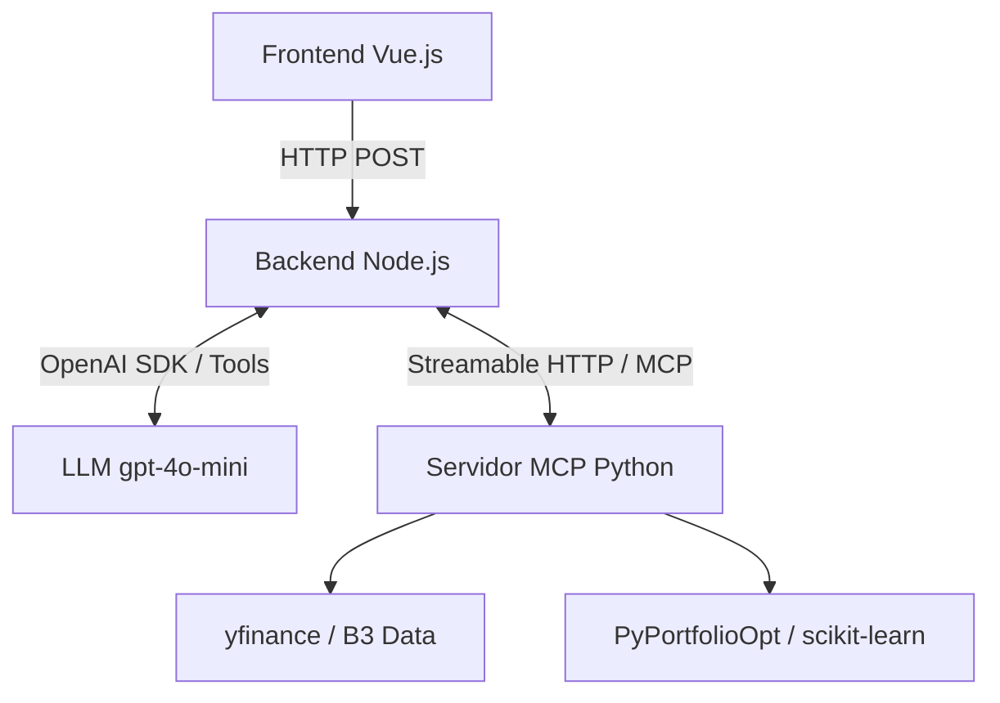

# TCC-USP-ESALQ: Sistemas Multiagentes e Protocolo MCP na Otimização de Portfólios e Gestão de Risco na B3 

Este repositório contém o código-fonte do Trabalho de Conclusão de Curso (TCC) desenvolvido para o MBA em Data Science e Analytics da **USP/Esalq**.

O projeto propõe uma arquitetura inovadora que une Inteligência Artificial Generativa e finanças quantitativas, utilizando **Function Calling (Agentic AI)** e o **Model Context Protocol (MCP)** para automatizar a otimização de portfólios de ativos da B3, gestão de risco e aplicação de algoritmos de clusterização em dados financeiros.

---

## Objetivo do Projeto

O mercado de capitais brasileiro exige métodos analíticos avançados para lidar com sua acentuada volatilidade. Embora os *Large Language Models* (LLMs) sejam excelentes na interpretação de cenários, eles sofrem com alucinações em cálculos aritméticos rigorosos. 

O objetivo deste projeto é demonstrar que a dissociação estrutural entre a camada de raciocínio linguístico da IA e os módulos quantitativos viabiliza recomendações de investimento precisas. O sistema delega cálculos estatísticos determinísticos (como Fronteira de Markowitz, VaR, Índice de Sharpe e Clusterização) para um servidor MCP especializado, enquanto um orquestrador centraliza a lógica do agente autônomo, garantindo fidedignidade analítica.

---

## Arquitetura e Fluxograma

O sistema foi arquitetado em **três camadas independentes**, utilizando comunicação via Streamable HTTP (SSE) para garantir que a interface de usuário, o cérebro da IA e o motor matemático operem de forma desacoplada e escalável.

### Fluxograma do Sistema



1. **Camada de Apresentação (Frontend):** Recebe o input do usuário e renderiza o raciocínio e análises geradas em Markdown.
2. **Camada de Orquestração (Backend):** Gerencia o histórico conversacional, extrai as ferramentas disponíveis no MCP e orquestra a comunicação entre a OpenAI e o Python.
3. **Camada Quantitativa (Motor Python):** Expõe as ferramentas financeiras (`tools`) estritas, garantindo o processamento isolado de matrizes de risco, covariância e clusterização.

---

## Tecnologias Utilizadas

* **Frontend:** Vue 3, Vite, `marked` (Renderização de Markdown dinâmico)
* **Backend Orquestrador:** Node.js, Express, `@modelcontextprotocol/sdk` (Client), OpenAI SDK
* **Motor Quantitativo MCP:** Python 3.12+, `mcp` (Server v2.x), Uvicorn/Starlette
* **Ciência de Dados & Finanças:** `pandas`, `numpy`, `PyPortfolioOpt`, `yfinance`, `scikit-learn` (Clusterização e Matriz de Covariância)

---

## 📂 Estrutura do Repositório

```text
TCC-USP-ESALQ
 ┣ EconomicAi
 ┃ ┣ src
 ┃ ┃ ┣ frontend              # Interface interativa (Dashboards e Chat)
 ┃ ┃ ┗ backend               # Orquestrador Node.js
 ┃ ┃   ┣ aiController.js     # Lógica de interação com OpenAI e Tool Calling
 ┃ ┃   ┣ mcpClient.js        # Configuração do StreamableHTTPClientTransport
 ┃ ┃   ┗ server.js           # Ponto de entrada da API Express (Porta 3000)
 ┣ mcp_servers
 ┃ ┗ risk_server             # Módulo de cálculos determinísticos
 ┃   ┣ server.py             # Servidor HTTP MCP (Porta 8000)
 ┃   ┗ calculators.py        # Algoritmos de Markowitz, VaR e Beta
 ┣ requirements.txt          # Dependências do motor Python
 ┣ package.json              # Dependências do ecossistema Node/Vue
 ┣ .env.example              # Template de chaves (OPENAI_API_KEY)
 ┗ README.md                 # Documentação principal
```

---

## 🚀 Como Executar o Projeto

A execução do ambiente completo requer a inicialização dos microsserviços em **três terminais separados**:

### 1. Subir o Motor Quantitativo (Python)
Responsável por expor os cálculos de risco via Model Context Protocol.
```bash
# Ative seu ambiente virtual (ex: venv)
pip install -r requirements.txt
python mcp_servers/risk_server/server.py
```
*(O servidor MCP ficará escutando na porta 8000).*

### 2. Subir o Backend Orquestrador (Node.js)
Responsável por conectar o chat, a OpenAI e o servidor Python.
```bash
cd EconomicAi/src/backend
npm install
npm start
```
*(A API Node ficará ativa na porta 3000).*

### 3. Subir a Interface de Usuário (Vue.js)
```bash
cd EconomicAi/src/frontend
npm install
npm run dev
```
*(Acesse o navegador no endereço local gerado pelo Vite, geralmente `http://localhost:5173`).*